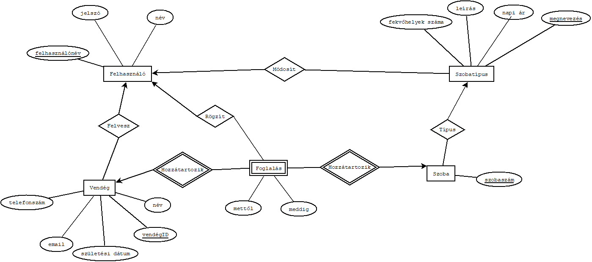

# Szálloda kezelő rendszer - Adatbázisok kötelező feladat

- Név: Hajagos-Tóth Martin
- Neptun kód: F1H43C

## Rendszerspecifikáció


  - Az elkészítendő szállodai alkalmazásban a recepciósok képesek lesznek nyomon követni és    kezelni a szobákat, szobatípusokat, vendégeket, foglalálsokat. A recepciósoknak lehetőségük lesz regisztrálni, majd bejelentkezni, hogy hozzáférjenek az alkalmazás funkcióihoz.
  A bejlentkezett felhasználók képesek lesznek új vendégeket felvenni a rendszerbe, majd rögzíthetnek a vendégedkhez foglalásokat. Az alkalmazás lehetővé teszi, hogy frissítsék a már meglévő vedégek adatait és a foglalások állapotát. Összeségében, a rendszer átfogó eszközt kínál a recepciósoknak a szálloda adatainak kezelésére.

## Funkciók

- Új vendégek adatainak felvitele a rendszerbe
- Meglévő vendégek adatainak módisítása
- Szobák felvitele és módosítása rendszerbe
- Szobatípusok felvitele és modosítása
- Foglalások kezelése, törlése, módosítása


## Egyed-kapcsolat diagram


## Egyed-Kapcsolat diagram leírása

- A Felhasználó, a Vendég, a Szoba, a Szobatípus egyedek és a Foglalás egyed egy gyenge egyed, mert nem határozza meg egyértelműen semmilyen adata sem. Kettő 1:N-hez tipusú meghatározó kapcsolat köti össze a Vendgéggel, és a Szobával, egy foglalás csak egyetlen vendéghez tartozhat, és egy szoba csak egy foglaláshoz tartozhat, de egy szobához, vagy egy vendéghez több foglalás is tartozhat. Csak két meghatározó kapcsolatal lehetmeghatározni, egy foglalást, mert egy vendég több szobát is a foglalhat ugyannara az időpontra. A Felvesz, Rögzít és a Módosít kapcsaolatok 1:N-hez, mert csak egy felhasznaló veheti, fel, rögzíthetiaz adatokat, de egy felhasználó több vendéget is felvehet, vagy módoíthat adatokat. A Szoba és Szobatípusok között is 1:N kapcsolat van, mert egy szobatípus több szobához is tartozhat.


## Relációs adatbázisséma

- FELHASZNALÓ(<u>felhasználonév</u>, név, jelszó)
- VENDÉG(<u>vendégID</u>, név, email, telefonszám, születési dátum)
- SZOBATÍPUS(<u>megnevezésid</u>, megnevezés, leirás, napi ár, fekvőhelyek száma)
- SZOBA(<u>szobaszám</u>, *megnevezésid*)
- FOGLALÁS(*vendégID*, <u>*szobaszám*</u>, <u>mettől</u>, meddig)

## Normalizálás

### Funkcionális függőségek

{felhasználónév} →{név, jelszó}

{felhasználónév, név} →{jelszó} 

{felhasználónév, jelszó} →{név}

  <br/>
  
{vendégid} → {név, email, telefonszám, születési dátum}

{vendégid, név} → {email, telefonszám, születési dátum}

{vendégid, email} → {név, telefonszám, születési dátum}

{vendégid, telefonszám} → {név, email, születési dátum}

{vendégid, születési dátum} → {név, email, telefonszám}

{vendégid, név, email} → {telefonszám, születési dátum}

{vendégid, név, telefonszám} → {email, születési dátum}

{vendégid, név, születési dátum} → { email, telefonszám}

{vendégid, email, telefonszám} → {név, születési dátum}

{vendégid, email, születési dátum} → {név, telefonszám}

{vendégid, telefonszám, születési dátum} → {név, email}

{vendégid, név, email, telefonszám} → {születési dátum}

{vendégid, név, email, születési dátum} → {telefonszám}

{vendégid, név, telefonszám, születési dátum} → {email}

{vendégid,  email, telefonszám, születési dátum} → {név}

  <br/>

{megnevezésid} → {megnevezés, leírás, napi ár, fekvőhelyek száma}

{megnevezésid, leírás} → {napi ár, fekvőhelyek száma, megnevezés}

{megnevezésid, napi ár} → {leírás, fekvőhelyek száma, megnevezés}

{megnevezésid, fekvőhelyek száma} → {leírás, napi ár, megnevezés}

{megnevezésid, leírás, napi ár} → {fekvőhelyek száma, megnevezés}

{megnevezésid, leírás, fekvőhelyek száma} → {napi ár, megnevezés}

{megnevezésid, napi ár, fekvőhelyek száma} → {leírás, megnevezés}

{megnevezésid, megnevezés} → {leírás, napi ár, fekvőhelyek száma}

{megnevezésid, megnevezés, leírás} → {napi ár, fekvőhelyek száma}

{megnevezésid, megnevezés, napi ár} → {leírás, fekvőhelyek száma}

{megnevezésid, megnevezés, fekvőhelyek száma} → {leírás, napi ár}

{megnevezésid, megnevezés, leírás, napi ár} → {fekvőhelyek száma}

{megnevezésid, megnevezés, napi ár, fekvőhelyek száma} → {leírás}

{megnevezésid, megnevezés, leírás, fekvőhelyek száma} → {napi ár}

 <br/>
 
{szobaszám} → {megnevezés}

<br/>

{szobaszam, mettől} → {vendégID, meddig}

{szobaszam, mettől, vendégID} → {meddig}

{szobaszam, mettől, meddig} → {vendégID}


### Kulcsok

FELHASZNALÓ(felhasználonév, név, jelszó)

- Kulcs: felhasználónév
- Ez a legszűkebb halmaz, amelynek lezártja visszaadja a teljes attribútumhalmazt.

VENDÉG(vendégID, név, email, telefonszám, születési dátum)

- Kulcs: vendégID
- Ez a legszűkebb halmaz, amelynek lezártja visszaadja a teljes attribútumhalmazt.

SZOBATÍPUS(<u>megnevezésid</u>, megnevezés, leirás, napi ár, fekvőhelyek száma)

- Kulcs: megnevezésid
- Ez a legszűkebb halmaz, amelynek lezártja visszaadja a teljes attribútumhalmazt.

SZOBA(<u>szobaszám</u>, *<u>megnevezés</u>*)

- Kulcsok: szobaszám, megnevezés
- Ez a legszűkebb halmaz, amelynek lezártja visszaadja a teljes attribútumhalmazt.

FOGLALÁS(*vendégID*, *<u>szobaszám</u>*, <u>mettől</u>, meddig)

- Kulcsok: {szobaszám, mettől}, {szobaszám, meddig}
- Ezek a legszűkebb halmazok, amelynek lezártja visszaadja a teljes attribútumhalmazt.

### 1NF 
- Az első normálforma teljesül, mert a sémák csak atomi attribútumot tartalmaznak és minden táblának van kulcsa, ezért teljesül az 1NF.

### 2NF
- A második normálformánka a feltétle az első, ami teljesül. Minden nem kulcs attribútum teljesen fugg a kulcstól, ezért teljesül a 2NF is.

### 3NF
- A harmadik normálformának feltétele a második, ami teljesül. A nem kulcs attributimok között nincs tartinzív függés, így a 3NF is teljesül.

## Tábla tervek
### Felhasználó
| Attribútum     | Típus      | Megjegyzés                         |
|----------------|------------|------------------------------------|
| 🔑 felhasználónév | VARCHAR(25) | A felhasználónév a kulcs           |
| név            | VARCHAR(40) | A felhasználó neve                 |
| jelszó         | VARCHAR(255) | A felhasznéló titkosított jelszava |
### SZOBATÍPUS
| Attribútum | Típus | Megjegyzés |
| ---------- | ----- | ---------- |
| 🔑 id | INT(11) | A szobatípus id a kulcs |
| megnevezés | VARCHAR(50) | A szobatípus megnevezése |
| leirás | TEXT | A szobatípus leírása |
| napi ár | INT(11) | A szobatípus napi ára |
| fekvőhelyek száma | INT(11) | A szobatípusban lévő fekvőhelyek száma |

### SZOBA
| Attribútum | Típus | Megjegyzés |
| --- | --- | --- |
| 🔑 szobaszám | INT(11) | A szobaszám a kulcs |
| 🔑🔗 megnevezésid | INT(11) | A megnevezés a külső kulcs, ami a Szobatípus táblára hivatkozik |

### FOGLALÁS
| Attribútum | Típus | Megjegyzés |
| --- | --- | --- |
| 🔗 vendégID | INT(?) | A vendégID a külső kulcs, ami a Vendég táblára hivatkozik |
| 🔑🔗 szobaszám | INT(?) | A szobaszám a külső kulcs, ami a Szoba táblára hivatkozik |
| 🔑 mettől | DATE(?) | A foglalás kezdete |
| meddig | DATE(?) | A foglalás vége |

## Összetett lekérdezések


```
  SELECT szobaszam, szobatipusok.megnevezes, napiar 
  FROM szobak,szobatipusok WHERE szobak.megnevezesid = szobatipusok.megnevezesid 
  AND szobak.megnevezesid = '$megnevezesid' 
  AND szobaszam NOT IN ( SELECT szobaszam FROM foglalasok 
  WHERE ('$mettol' BETWEEN mettol AND meddig) 
  OR '$meddig' BETWEEN mettol AND meddig)
```

- Ebben a lérdezéseben azokat a szobakat adja eredményül, amik megfelelő megnevezesid-val rendelkeznek és nincsenek lefoglalva a megadott intervallumon.

##

```
SELECT szobak.szobaszam, szobatipusok.megnevezes, napiar, fekvohelyekszama 
FROM szobak, szobatipusok 
WHERE szobak.megnevezesid = szobatipusok.megnevezesid 
AND szobak.szobaszam NOT IN (SELECT szobaszam from foglalasok 
WHERE CURRENT_DATE() BETWEEN mettol AND meddig)
```
- Ezzel a lekérdzéssel listázom ki az üres szobakat a jelenlegi napon.

##
  
```
SELECT szobatipusok.megnevezes, COUNT(*) AS darab 
FROM szobak JOIN szobatipusok ON szobak.megnevezesid = szobatipusok.megnevezesid 
GROUP BY szobatipusok.megnevezesid
```
- Ebben a lekérdezésben megszámolom, hogy melyik szobatípusból mennyi db van.

##

```
SELECT foglalasok.vendegid, foglalasok.szobaszam, foglalasok.mettol 
FROM foglalasok JOIN szobak ON foglalasok.szobaszam = szobak.szobaszam 
JOIN szobatipusok ON szobak.megnevezesid = szobatipusok.megnevezesid 
WHERE szobatipusok.fekvohelyekszama >= 3 ORDER BY foglalasok.mettol
```
- Ebben a lekérdezésben azokat a foglalásokat kérem le amelyek hárommnál több fekvőhellyel rendelkező szobákra szolnak.

##

```
SELECT vendegek.nev, SUM(DATEDIFF(foglalasok.meddig, foglalasok.mettol)*szobatipusok.napiar) AS osszesen 
FROM foglalasok JOIN vendegek ON foglalasok.vendegid = vendegek.vendegid 
    JOIN szobak ON foglalasok.szobaszam = szobak.szobaszam 
    JOIN szobatipusok ON szobak.megnevezesid = szobatipusok.megnevezesid 
    WHERE vendegek.vendegid = ( SELECT vendegid FROM vendegek ORDER BY vendegek.szuletesidatum ASC LIMIT 1 )
```
- Ebben a lekérdezésben a legidősebb vendéget kapom eredményül akinek a foglalásokhoz tartozó fizetendő összeget szummázom.

## Megvalósított funkciók
  - Regisztráció
  - Bejelentkezés
  - Vendég felvétele
  - Szoba napi árának módosítása
  - Foglalás felvétele
  - Foglalás módosítása
  - Foglalás törlése
  - Vendég törlése

## Megvalósítás, Technológia

A projekt a következő technológiákat/szoftvereket fogja használni a munka során:

- Egyszerű xamppalapú szerver MySQL adatbázissal
- PHP (backend)
- HTML (frontend)
- VSCode IDE

Szeged, 2023
